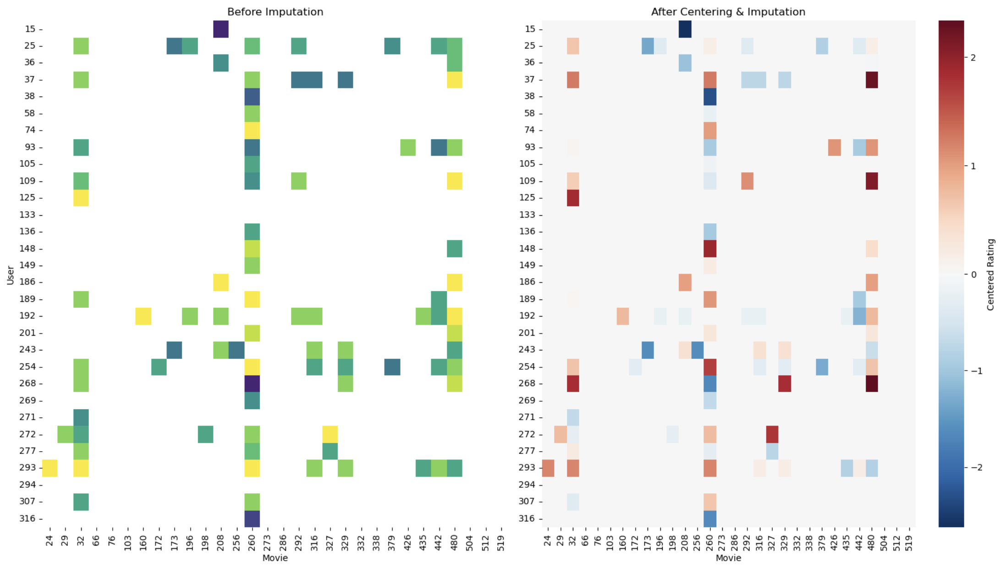
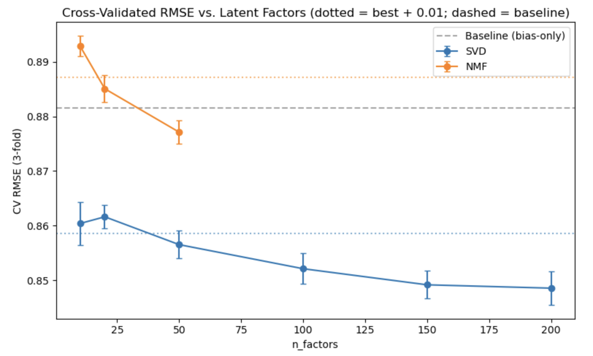
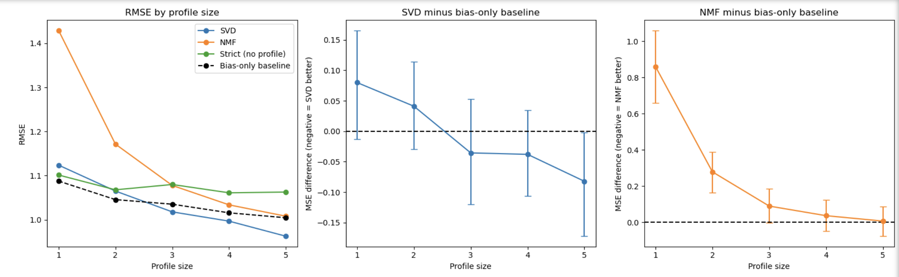

[](https://www.linkedin.com/in/orhan-kaplan-phd-5a4a84212/)

# 🚀 Sci‑Fi Movie Recommendation for Cold-Start Users: A Comparison of KNN, SVD, and NMF 


## 📝 1. Summary

This project builds and compares two families of collaborative filtering recommenders — memory-based `K-Nearest Neighbors (KNN)` and model-based `Matrix Factorization (SVD and NMF)` — using the MovieLens 32M dataset. The analysis focuses specifically on Sci‑Fi movie preferences to reduce sparsity and improve neighborhood similarity, and is evaluated in two stages: first on active users (7+ ratings), then on cold-start users (≤ 6 ratings), the segment the project is framed around. Beyond rating accuracy (`RMSE`, `MAE`), evaluation includes `precision@k` and `recall@k`, since ranking quality — not just rating prediction — is what a recommender is actually asked to deliver.

## 🎯 2. Objectives

**Business case:** Streaming platforms depend on personalization to retain users, but new or low-activity users generate few ratings, making confident recommendations difficult. This project asks whether the choice of recommendation algorithm materially changes recommendation quality — and whether any of that quality survives for cold-start users, a realistic business scenario rather than an edge case to avoid.

**Technical goals:**

- Build a memory-based `KNN` collaborative filtering baseline, including user-mean centering and a pre-imputation sparsity diagnostic.
- Build two model-based alternatives — `SVD` and `NMF` — that train on observed ratings only, avoiding the imputation-driven signal dilution identified in the `KNN` pipeline.
- Compare all approaches against a bias-only baseline ($\mu + b_u + b_i$) to isolate how much predictive value comes from latent factors versus simple rating tendencies.
- Evaluate on rating accuracy (`RMSE`, `MAE`) *and* ranking quality (`precision@k`, `recall@k`), since the two can disagree.
- Evaluate cold-start behavior by profile size (1–5 ratings) with bootstrap confidence intervals, and identify the profile size at which each model begins to beat the baseline.
- Run a genre-granularity case study (Exploratory Factor Analysis on Sci-Fi sub-genres) to test whether "Sci-Fi" is too coarse a taste unit for similarity-based recommendation.


## 📂 3. Dataset

The project uses the **MovieLens 32M** dataset (Harper & Konstan, 2015), provided by GroupLens Research. The dataset contains user ratings, movie metadata, genres, and related identifiers; this analysis primarily uses user ratings and movie genres.

- **Source:** [https://grouplens.org/datasets/movielens/32m/](https://grouplens.org/datasets/movielens/32m/)
- **Citation:** F. Maxwell Harper and Joseph A. Konstan. 2015. *The MovieLens Datasets: History and Context.* ACM Transactions on Interactive Intelligent Systems (TiiS) 5, 4: 19:1–19:19. [https://doi.org/10.1145/2827872](https://doi.org/10.1145/2827872)

**Filtering and subsetting applied before modeling:**

- Ratings were merged with movie metadata and filtered to the **Sci-Fi** genre, reducing sparsity and concentrating overlapping user preferences.
- Active users (7+ ratings) and cold-start users (≤ 6 ratings, the 25th-percentile cutoff) were separated for staged evaluation.
- A statistically justified reduced sample was drawn using **Cochran's formula** (1977) at 95% confidence and a 2% margin of error, then calibrated upward for practical modeling; validity checks confirmed the reduced sample preserves the rating-frequency distribution of the full population.

## 🔧 4. Methodology

The pipeline runs across four notebooks, each building on the previous stage:

1. **Data preparation.** Ratings were merged with movie metadata (inner join, validated many-to-one), filtered to the Sci-Fi genre, and split into active and cold-start user groups. A Cochran-adjusted random sample was drawn for iterative development, with a distribution check confirming representativeness against the full population.
2. **Feature engineering.** A user–movie rating matrix was constructed and **user-mean centered** to remove individual rater bias. For the `KNN` pipeline only, missing ratings were imputed with each user's centered mean (0), a necessary step for distance-based similarity but one that manufactures unobserved signal; the before/after sparsity diagnostic makes this tradeoff explicit. `SVD` and `NMF` bypass imputation entirely by training on observed ratings only.
3. **Memory-based modeling (`KNN`).** A `KNeighborsRegressor` with inverse-distance weighting was tuned over neighborhood size $k$, distance metric (Euclidean, Cosine, Manhattan), tuned over neighborhood size $k$ (Manhattan distance), then compared across distance metrics (Euclidean, Cosine, Manhattan) at the selected $k$. It was evaluated with an 80/20 train–test split over users, scoring one target movie per user; because $k$ was selected on the same test split, the reported error is likely slightly optimistic.. A genre-granularity case study used Exploratory Factor Analysis on Sci-Fi sub-genre co-occurrence to test whether restricting similarity computation to a latent genre factor (Action/Adventure) improves neighbor quality.
5. **Model-based modeling (`SVD`, `NMF`).** Both models were fit with `surprise`, using a three-way 60/20/20 split over ratings. A **bias-only baseline** ($\mu + b_u + b_i$) established the floor that latent-factor models must beat. An exhaustive grid search tuned $n_\text{factors}$, regularization, learning rate, and epochs; the final factor count was chosen for generalization gap rather than raw validation minimum. Ranking quality was evaluated with `precision@k` and `recall@k` against a popularity baseline.
6. **Cold-start evaluation.** One random rating per cold-start user was held out as the evaluation target; remaining ratings formed the user's profile. Models were trained on active-user data combined with all profiles, and evaluated by profile size (1–5 ratings) with paired bootstrap confidence intervals against the bias-only baseline.




## 📊 5. Key Findings & Model Performance

Model performance is reported in two stages: first on **active users** (7+ ratings), then on **cold-start users** (≤ 6 ratings). Unless the *Eval set* column says otherwise, metrics are from the final held-out test set.

### Active Users

| Model | Eval set | RMSE | MAE | Notes |
|---|---|---|---|---|
| Bias-only baseline ($\mu + b_u + b_i$) | Validation | 0.871 | 0.669 | Floor for latent-factor comparison; not rescored on the test set |
| `SVD` ($n_\text{factors}=20$) | Validation | 0.820 | — | Same-set partner for the baseline: ~6% lower RMSE |
| `SVD` ($n_\text{factors}=20$) | Test | 0.813 | 0.615 | Best rating-accuracy model; refit on train + validation |
| `NMF` ($n_\text{factors}=10$) | Test | 0.843 | 0.649 | Weaker than `SVD` across all metrics; refit on train + validation |
| `KNN` (centered, k=14, Manhattan) | Test (different protocol) | 0.931 | 0.759 | R² = −0.14; one target movie per user, so not directly comparable to the rows above |

**Note:** All SVD/NMF/baseline rows are scored on the same held-out test set (112,104 ratings), with models refit on train + validation.  
**Note on the KNN comparison.** `KNN` was evaluated under a different protocol from `SVD`/`NMF`: an 80/20 train–test split over 8,724 users (6,979 / 1,745), scoring one target movie per user, versus 112,104 test ratings for the matrix-factorization models. Its error is shown for reference, not as a like-for-like ranking. Because k was selected on the same test split that is reported, the `KNN` error is likely slightly optimistic. Centering ratings by user mean removed an implicit rating-level shortcut: in the earlier uncentered run, imputed cells dominated by each user's own mean let the model predict toward a user's typical rating rather than shared taste, and `KNN` MSE rose from roughly 0.73 to roughly 0.89 after centering. An R² of −0.14 on the centered scale means it did worse than predicting each user's own average. The centered result is the more defensible one, but it is tentative: in the same notebook, Cosine distance gave lower error (RMSE 0.828, MAE 0.632) than the Manhattan configuration reported here, and k was tuned for Manhattan only.

### Ranking Quality (Active Users)

| Model | Precision@10 | Recall@10 |
|---|---|---|
| `SVD` | 0.035 | 0.075 |
| `NMF` | 0.028 | 0.067 |
| Popularity baseline | **0.136** | **0.288** |

On top-10 ranking, neither matrix-factorization model beats a trivial popularity baseline — popularity is roughly 4–5× better on precision and 4× better on recall. A multi-$k$ sweep confirmed the pattern: precision stays flat as $k$ grows (0.027 → 0.016 from $k=10$ to $k=200$), the signature of a ranking that carries little signal beyond base rates.

### Cold-Start Users

Cold-start results are reported by **profile size** (number of ratings available after one is held out as the evaluation target), with paired bootstrap confidence intervals against the bias-only baseline.

- **The profile itself is the dominant signal.** The strict baseline ($\mu + b_i$, no profile) is worse than the bias-only baseline at every profile size, with the gap widening from 0.030 MSE at profile size 1 to 0.120 at size 5. Having *any* profile beats having none.
- **`SVD` overtakes the baseline in point estimate between profile sizes 2 and 3, but is statistically distinguishable only at size 5.** Its paired MSE difference moves from +0.080 at size 1 to −0.082 at size 5. The 95% bootstrap CI excludes zero only at size 5 ([−0.173, −0.002]), a borderline result: the upper bound is barely below zero, and no correction was made for testing five profile sizes. At sizes 1–4 the CIs include zero, so a crossing at about three ratings is a directional trend, not a confirmed threshold.
- **`NMF` never beats the baseline.** Its paired MSE difference is significantly positive at profile sizes 1 and 2 (95% CI excludes zero), borderline at size 3 (CI [−0.001, 0.186]), and positive but indistinguishable from zero at sizes 4–5. One possible explanation is that `biased=False` leaves `NMF`'s user factors poorly determined under small profiles; this was not tested.  
- **For users with no profile, the item bias alone helps.** Among 635 profile-0 users, replacing $\mu$ with $\mu + b_i$ reduces RMSE from 1.198 to 1.144 (paired MSE difference −0.125, 95% CI [−0.215, −0.036]).

### Headline Interpretation

In plain terms: on this dataset, **item-level signal — popularity and item biases — carries most of the predictable variance**, and model class matters less than whether a model can absorb that signal at all. `SVD` is the strongest rating-prediction model among those tested, beating both the bias-only baseline and `NMF` on every metric, but its advantage over the baseline is modest and only emerges once a user has accumulated a few ratings. For ranking, no model tested beats simple popularity. For cold-start users specifically, a popularity-based or bias-only recommender is a reasonable default until a profile of roughly three to five ratings accumulates (the evidence for switching is strongest at five).






## 🧩 6. Business Questions & Key Insights

### 1. Does the choice of algorithm materially change recommendation quality, and is the difference worth the added complexity in production?

**Partly — and only for rating prediction.** On the validation set, `SVD` reduces RMSE by about 6% relative to the bias-only baseline (0.820 vs. 0.871); held-out test results for `SVD` (0.813) and `NMF` (0.843) are consistent with this. The margin is modest. The centered `KNN` model (different evaluation protocol; see the note above) had R² = −0.14, worse than predicting each user's own average, which suggests that similarity over a heavily imputed matrix captures little shared-taste signal. That conclusion is tentative, since Cosine distance scored lower error than the Manhattan configuration reported.

**Practical implication:** For a production recommender on sparse, Sci-Fi-filtered data, latent-factor models are worth the added complexity — but only modestly, and only if the system can absorb user/item bias terms. A bias-only model is a strong, cheap default.

### 2. How do the models perform on measures that matter for real recommendation use — precision and recall at k?

**Poorly, relative to popularity.** On top-10 ranking for active users:

| Model | Precision@10 | Recall@10 |
|---|---|---|
| `SVD` | 0.035 | 0.075 |
| `NMF` | 0.028 | 0.067 |
| Popularity | **0.136** | **0.288** |

Neither matrix-factorization model beats a trivial popularity baseline — popularity is 4–5× better on precision and ~4× better on recall. A multi-$k$ sweep confirmed this is not a threshold artifact: precision stays flat as $k$ grows, meaning items ranked 10–200 are roughly as likely to be relevant as items ranked 1–10. The models' rankings carry little personalized signal beyond what item bias already captures.

**Practical implication:** In cold or sparse settings, "most-rated" is a stronger top-k strategy than either latent-factor model. Ranking metrics, not RMSE, should drive the go/no-go decision for a personalized ranker.

### 3. Can the system generate reliable suggestions for cold-start users, or does that require a fundamentally different approach?

**The profile, not the model, is the primary source of improvement.** Across profile sizes 1–5:

- The strict baseline ($\mu + b_i$, no profile) is worse than the bias-only baseline at every size, with a widening gap (0.030 → 0.120 MSE). Any profile beats no profile.
- `SVD`'s paired MSE difference against the baseline crosses zero between profile sizes 2 and 3 and reaches −0.082 at size 5. Only the size-5 CI excludes zero ([−0.173, −0.002], borderline); at sizes 1–4 the difference is a directional trend.
- `NMF` never beats the baseline; it is significantly worse at profile sizes 1–2 and borderline at size 3.

**Practical implication:** A bias-only (or popularity) recommender is the safe default for the smallest profiles. `SVD`'s advantage is statistically distinguishable only at five ratings, so any switch point between three and five ratings is a hypothesis to confirm with more data, not a validated threshold. `NMF` should not be used for cold-start segments under this configuration.

### 4. Is "Sci-Fi" a good enough taste unit for similarity-based recommendation?

**Likely too coarse.** A genre-granularity case study using Exploratory Factor Analysis on Sci-Fi sub-genre co-occurrence identified a coherent **Action/Adventure** latent factor. Recomputing user similarity within just that sub-genre reduced the average rating gap on shared movies from ~1.12 to ~0.65 (a ~42% reduction) and increased shared-movie overlap from 2–5 to 5–8.

**Limitation:** This result comes from a single query user and small neighbor-overlap counts. It is a promising, well-evidenced direction rather than a statistically validated finding, but it suggests sub-genre granularity matters for neighborhood-based methods.

### 5. What does this mean for the original research question?

The original question — *how can we predict a user's rating for a movie based on patterns in similar users and similar movies, and how does model choice affect quality, especially for users with limited history?* — resolves to a consistent finding across the project: **item-level signal (popularity, item biases) carries most of the predictable variance in this dataset, and model class matters less than whether a model can absorb that signal at all.** `KNN` needed heavy imputation to compute similarity and lost signal as a result; `SVD` recovers some of it through latent factors but only at moderate profile sizes; `NMF`(fit without bias terms) did not recover that signal under small profiles; whether this reflects its non-negativity constraint or the biased=False setting was not tested.


### 🎬 Example: Personalized Recommendations with SVD

To demonstrate how the matrix-factorization model translates predicted ratings
into personalized recommendations, the following example shows the Top-5
unrated Sci-Fi movies predicted for a sample user using the tuned SVD model.

**Example user: 86087**

| Rank | Recommended Movie | Predicted Rating |
|:----:|-------------------|:----------------:|
| 1 | *Days of Eclipse* (1988) | **4.57** |
| 2 | *Visitor to a Museum (Posetitel muzeya)* (1989) | **4.37** |
| 3 | *The Centrifuge Brain Project* (2012) | **4.32** |
| 4 | *Interstellar* (2014) | **4.31** |
| 5 | *B/W* (2015) | **4.30** |

> **Interpretation:** These are not the user's existing ratings. They are
> SVD-generated predictions for movies the user has not previously rated,
> ranked by the model's estimated preference. The example illustrates how
> matrix factorization converts learned user–item latent representations into
> personalized Top-K recommendations.


## ⚙️ 7. Requirements

**Languages and core libraries**

| Package | Version |
|---|---|
| Python | 3.11 |
| pandas | ≥ 2.0 |
| NumPy | ≥ 1.24 |
| Matplotlib | ≥ 3.7 |
| seaborn | ≥ 0.12 |
| scikit-learn | ≥ 1.3 |
| scikit-surprise | ≥ 1.1.3 |
| SciPy | ≥ 1.10 |
| factor-analyzer | ≥ 0.5 |
| wordcloud | ≥ 1.9 |
| pyarrow | ≥ 14.0 |
| Jupyter Notebook / JupyterLab | ≥ 7.0 |

**Installation**

```bash
pip install -r requirements.txt
```

## ▶️ 8.How to Reproduce

### 1. Clone the repository

```bash
git clone https://github.com/nalpako2027/collaborative-filtering_movie-recommender.git
cd collaborative-filtering_movie-recommender
```

### 2. Install dependencies

```bash
pip install -r requirements.txt
```

See [⚙️ Requirements](#-requirements) for the full package list and version notes.

### 3. Download the data

The notebooks download **MovieLens 32M** automatically on first run:

- Dataset page: [https://grouplens.org/datasets/movielens/32m/](https://grouplens.org/datasets/movielens/32m/)
- Direct archive: [https://files.grouplens.org/datasets/movielens/ml-32m.zip](https://files.grouplens.org/datasets/movielens/ml-32m.zip)

`01_data_prep.ipynb` handles the download and extraction, validates ZIP integrity, and skips re-downloading if the files are already present.

### 4. Run the notebooks in order

| Step | Notebook | Purpose |
|---|---|---|
| 1 | `01_data_prep.ipynb` | Download, merge, Sci-Fi filter, Cochran sample, active/cold-start split |
| 2 | `02_knn_modeling.ipynb` | `KNN` baseline, hyperparameter tuning, genre-granularity case study |
| 3 | `03_svd_nmf_modeling.ipynb` | `SVD` / `NMF` tuning, ranking evaluation (`precision@k`, `recall@k`) |
| 4 | `04_cold_start.ipynb` | Cold-start evaluation by profile size with bootstrap CIs |

Each notebook reads the `.parquet` outputs written by the previous one. Running them out of order will fail on missing files.

### 5. Expected outputs

- `ml-32m/df_scifi_movies_reduced.parquet` — Cochran-sampled Sci-Fi ratings
- `ml-32m/df_active.parquet` — active-user subset (7+ ratings)
- `ml-32m/df_cold_start.parquet` — cold-start subset (≤ 6 ratings)
- Figures rendered inline in each notebook; selected figures are referenced from this README.

### 6. Reproducibility notes

- Random seeds are fixed (`random_state=72` for splits and models; `np.random.default_rng(72)` and `default_rng(42)` for the two bootstrap procedures).
- The train–validation–test split in Part 3 is over **ratings**, not users, so every active user almost always retains some training ratings.
- The cold-start holdout in Part 4 is one random rating per user; the remaining ratings form that user's profile.
- Exact hyperparameters selected in each part are documented inline in the notebooks and summarized in [📊 Key Findings & Model Performance](#-key-findings--model-performance).


## 🗂️ 9. Project Structure

```
collaborative-filtering_movie-recommender/
│
├── 01_data_prep.ipynb              # Download, merge, Sci-Fi filter, Cochran sample, active/cold-start split
├── 02_knn_modeling.ipynb           # KNN baseline, hyperparameter tuning, genre-granularity case study
├── 03_svd_nmf_modeling.ipynb       # SVD / NMF tuning, ranking evaluation (precision@k, recall@k)
├── 04_cold_start.ipynb             # Cold-start evaluation by profile size with bootstrap CIs
│
├── figures/                        # Figures referenced in this README
│   └── mov_rec1.png                # Before/after centering & imputation heatmap
│
├── ml-32m/                         # Data directory (created at runtime; not committed)
│   ├── df_scifi_movies_reduced.parquet   # Cochran-sampled Sci-Fi ratings
│   ├── df_active.parquet                 # Active-user subset (7+ ratings)
│   └── df_cold_start.parquet             # Cold-start subset (≤ 6 ratings)
│
├── requirements.txt                # Python dependencies
├── LICENSE
└── README.md
```

**Notes**

- The `ml-32m/` directory is generated by `01_data_prep.ipynb` and is not tracked in version control (add it to `.gitignore` if it isn't already).
- Each notebook reads the `.parquet` outputs written by the previous one; running them out of order will fail on missing files.
- Only figures referenced by this README are stored in `figures/`; the full set of plots is rendered inline in the notebooks.

## ⚠️ 10. Limitations & Further Recommendations

### Limitations

- **Sci-Fi-filtered subset.** Findings describe a randomly selected single-genre sample of MovieLens 32M. Results may differ on the full catalog or other genres; this was not tested.
- **Partial cold-start definition.** Cold-start users have 1–6 ratings of their own; a genuinely unseen user is not modeled. Under a strict definition, `SVD` and `NMF` collapse to $\mu + b_i$ and $\mu$ respectively, making the comparison trivial.
- **Mean imputation dominates the `KNN` feature matrix.** With under 5% observed coverage per user, most of the `KNN` matrix is imputed rather than observed. This manufactures unobserved signal and is the key reason `KNN` underperforms once centering removes the rating-level shortcut. `SVD` and `NMF` avoid this by training on observed ratings only, though the comparison cannot fully separate model class from imputation effects.
- **Wide confidence intervals at the per-stratum level.** With ~1,000 users per profile size and one held-out target each, 95% bootstrap CIs are roughly ±0.09 MSE. `SVD`'s crossing of the baseline is a directional trend, not a confirmed threshold.
- **`NMF`'s `biased=False` was inherited from Part 3, not re-tuned for cold-start.** Whether a `biased=True` `NMF` would fare better on small profiles is untested. The cold-start underperformance is a result for this configuration, not a general claim about `NMF`.
- **Genre-granularity finding is exploratory.** The Action/Adventure improvement comes from a single query user and small neighbor-overlap counts, with an EFA KMO score (0.585) just below the conventional threshold.

### Further Recommendations

- **Test a `biased=True` `NMF` on cold-start profiles**, since `biased=False` leaves user factors poorly determined at small profile sizes.
- **Replace single-holdout cold-start evaluation with repeated holdouts or K-fold over users** to resolve the profile-size crossing points with tighter intervals.
- **Extend the genre-granularity case study** to multiple query users and validate the Action/Adventure factor on an independent sample.
- **Incorporate movie metadata and tags** (excluded here by design) to address item cold-start, which this project did not model.
- **Test on the full MovieLens 32M catalog and on other genres** to check whether the Sci-Fi-filtered conclusions generalize.


  
  
## 📚 References

Cochran, W. G. (1977). *Sampling techniques* (3rd ed.). John Wiley & Sons.

Efron, B., & Tibshirani, R. J. (1993). *An introduction to the bootstrap*. Chapman & Hall/CRC.

Harper, F. M., & Konstan, J. A. (2015). The MovieLens Datasets: History and Context. *ACM Transactions on Interactive Intelligent Systems (TiiS), 5*(4), 19:1–19:19. [https://doi.org/10.1145/2827872](https://doi.org/10.1145/2827872)

Hastie, T., Tibshirani, R., & Friedman, J. (2017). *The elements of statistical learning* (2nd ed.). Springer.

Koren, Y., Bell, R., & Volinsky, C. (2009). Matrix factorization techniques for recommender systems. *Computer, 42*(8), 30–37. [https://doi.org/10.1109/MC.2009.263](https://doi.org/10.1109/MC.2009.263)

Lee, D. D., & Seung, H. S. (2001). Algorithms for non-negative matrix factorization. *Advances in Neural Information Processing Systems, 13*.

Salako, J. (2026). Latent Geometry of Taste: Scalable Low-Rank Matrix Factorization for Recommender Systems. *arXiv preprint* [arXiv:2601.03466](https://arxiv.org/pdf/2601.03466).

scikit-learn documentation. `sklearn.neighbors.KNeighborsRegressor`. [https://scikit-learn.org/stable/modules/generated/sklearn.neighbors.KNeighborsRegressor.html](https://scikit-learn.org/stable/modules/generated/sklearn.neighbors.KNeighborsRegressor.html)

Surprise documentation. *SVD* and *NMF* predictors. [https://surpriselib.com/](https://surpriselib.com/)


## License


## 👤 Author / Attribution

**Orhan Kaplan, PhD**
- GitHub: [@nalpako2027](https://github.com/nalpako2027)
- LinkedIn: [orhan-kaplan-phd](https://www.linkedin.com/in/orhan-kaplan-phd-5a4a84212/)

If you use this project in research, publications, presentations, or other work, please cite or acknowledge:

> Orhan Kaplan (2026). *Sci‑Fi Movie Recommendation for Cold-Start Users: A Comparison of KNN, SVD, and NMF.*
> [https://github.com/nalpako2027/collaborative-filtering_movie-recommender.git](https://github.com/nalpako2027/collaborative-filtering_movie-recommender.git)

Original data: F. Maxwell Harper and Joseph A. Konstan. 2015. *The MovieLens Datasets: History and Context.* ACM Transactions on Interactive Intelligent Systems (TiiS) 5, 4: 19:1–19:19. [https://doi.org/10.1145/2827872](https://doi.org/10.1145/2827872)

